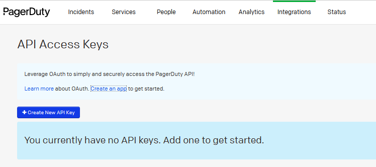
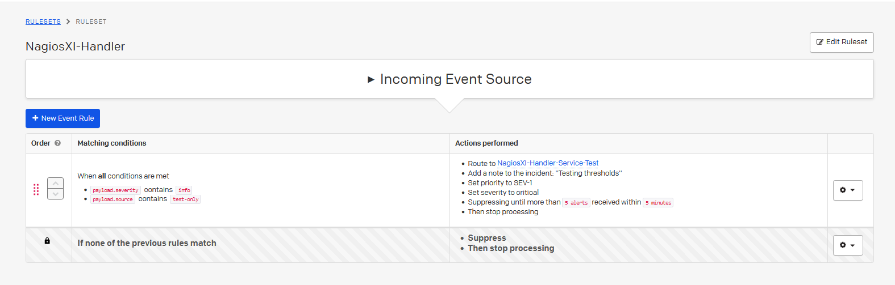
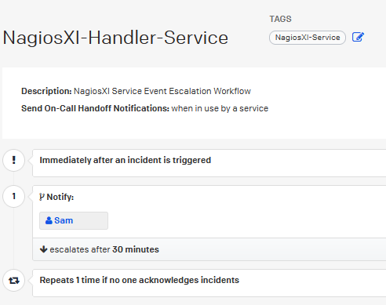
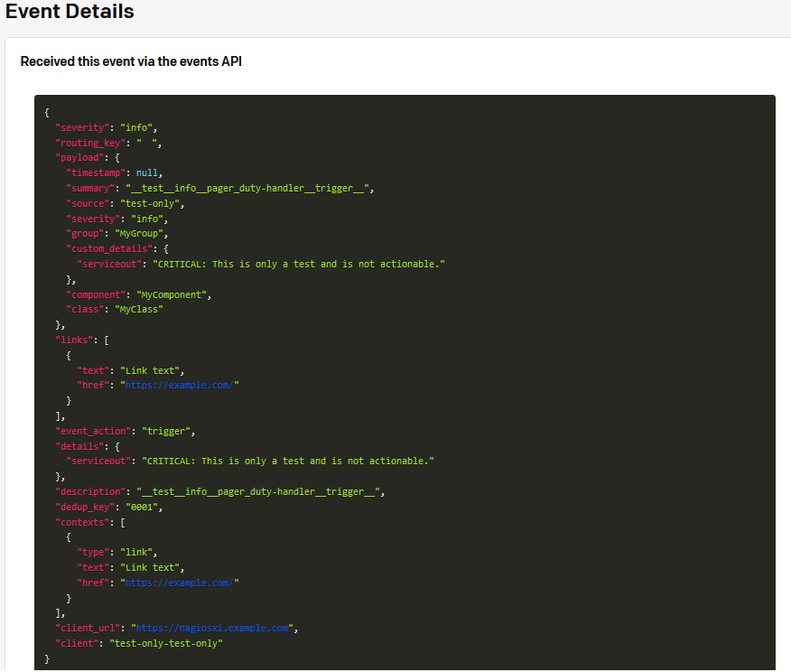
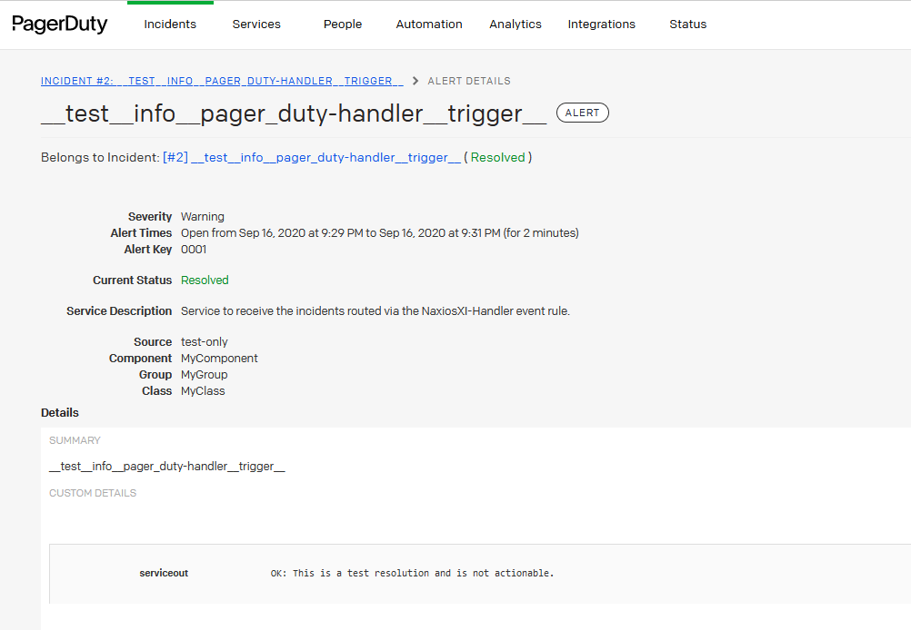

## CONFIGURE PAGERDUTY
### CREATE API KEY

### CREATE GLOBAL EVENT RULE AND FILTERS

### CFREATE SERVICE

## CONFIGURE NAGIOSXI
### DEPLOY FILES TO NAGIOSXI INSTANCE
    1. Copy nagiosxi-pagerduty-handler.py to the /usr/local/nagios/libexec/ directory
    2. Edit the nagiosxi-pagerduty-handler.yml file to include your PagerDuty API and Routing Keys
    3. Copy nagiosxi-pagerduty-handler.yml to the /usr/local/nagios/libexec/ directory
    4. chown nagios:nagios nagiosxi-pagerduty-handler.yml
    5. chown nagios:nagios nagiosxi-pagerduty-handler.py
    6. chmod +x nagiosxi-pagerduty-handler.py

### ENABLE NAGIOSXI REQUIRED MACROS

    # "$HOSTNAME$" 
    # "$SERVICEDESC$" 
    # "$HOSTADDRESS$" 
    #  $HOSTSTATE$ 
    #  $HOSTSTATEID$ 
    #  $HOSTEVENTID$ 
    #  $HOSTPROBLEMID$ 
    #  $SERVICESTATE$ 
    #  $SERVICESTATEID$ 
    #  $LASTSERVICESTATE$ 
    #  $LASTSERVICESTATEID$ 
    #  $LASTSERVICEEVENTID$ 
    #  $LASTSERVICEPROBLEMID$ 
    #  $SERVICESTATETYPE$ 
    #  $SERVICEATTEMPT$ 
    #  $MAXSERVICEATTEMPTS$ 
    #  $SERVICEEVENTID$ 
    #  $SERVICEPROBLEMID$ 
    #  "$SERVICEOUTPUT$" 
    #  "$LONGSERVICEOUTPUT$" 
    #  $SERVICEDOWNTIME$ 
    #  "$SERVICEACKCOMMENT$"  

### CREATE NAGIOS COMMAND
    python3 $USER1$/nagiosxi-pagerduty-handler.py --lastservicestateid="$LASTSERVICEPROBLEMID$" --servicestateid="$SERVICESTATEID$" --serviceeventid="$SERVICEPROBLEMID$" --serviceproblemid="$SERVICEEVENTID$" --lastserviceeventid="$LASTSEVICEEVENTID$" --lastserviceproblemid="$LASTSERVICEPROBLEMID$" --hostname="$HOSTNAME$" --type="Service" --summary="$SERVICEDESC$" --severity="INFO" --source="$HOSTNAME$" --component="MyComponent" --group="MyGroup" --class="MyClass" --customdetails="$SERVICEOUT$"

### ADD HANDLER TO NAGIOSXI SERVICE OBJECT_DEFINITION
    "event_handler":"nagiosxi-pagerduty-handler"
    "event_handler_enabled":"1"

### TRIGGER TEST OF THE HANDLER VIA THE COMMAND LINE
    python3 /usr/local/nagios/libexec/nagiosxi-pagerduty-hamdler.py --lastservicestateid="0" --servicestateid="2" --serviceeventid="0001" --serviceproblemid="0001" --lastserviceeventid="0000" --lastserviceproblemid="0000" --hostname="test-only" --type="Service" --summary="__test__info__pager_duty-handler__trigger__" --severity="INFO" --source="test-only" --component="MyComponent" --group="MyGroup" --class="MyClass" --customdetails="CRITICAL: This is only a test and is not actionable."

### USE ADVANCE OPTIONS TO SEND PASSIVE CHECK RESULT
STATE = 2
MSG = CRITICAL: This is only a test and is not actionable.

## VALIDATE EVENTS IN PAGERDUTY
### EVENT PAYLOAD CONTENT

### ALERTS

